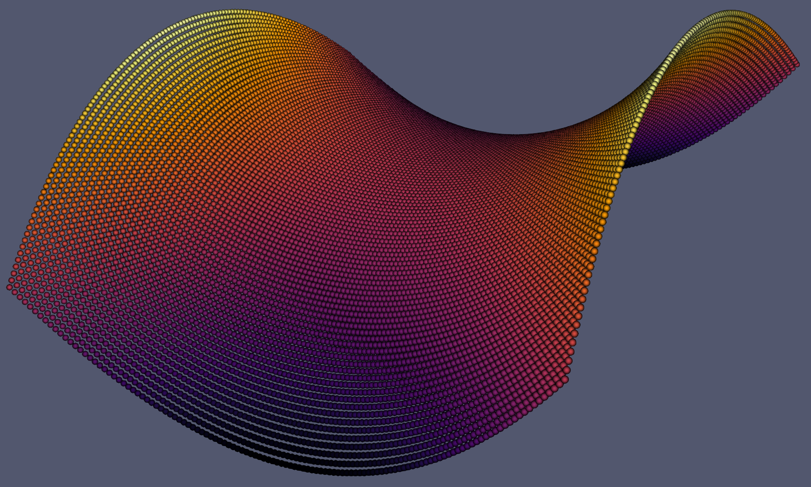
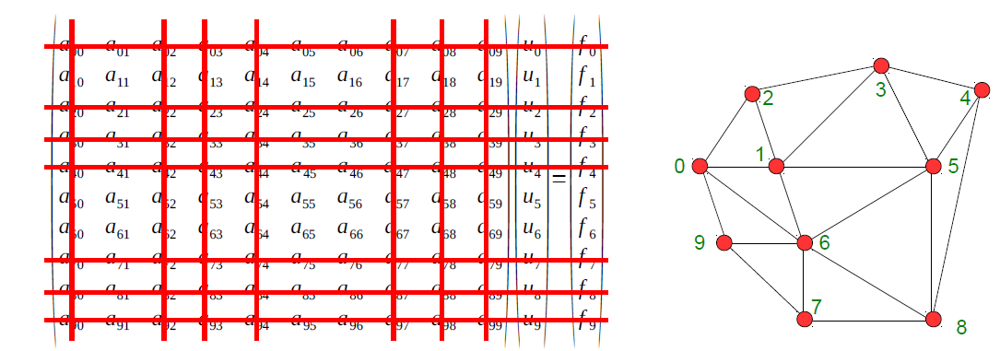

# FastFem



FastFem is a finite element method (FEM) library developed as part of the course "Implementation of Finite Element Methods" (MU5MAM30) at Sorbonne University. The project was created by Edoardo Carrà, Lorenzo Gentile, and Pierpaolo Marzo.

## Table of Contents

- [FastFem](#fastfem)
  - [Table of Contents](#table-of-contents)
  - [Overview](#overview)
  - [Features](#features)
  - [Installation](#installation)
    - [Requirements](#requirements)
    - [Build Instructions](#build-instructions)
  - [FastFem Example](#fastfem-example)
  - [FastFem Design](#fastfem-design)
    - [FastFem linear algebra](#fastfem-linear-algebra)
      - [**FastFem matrices**](#fastfem-matrices)
      - [**MatrixTools Utility Class**](#matrixtools-utility-class)
      - [Example: Applying Dirichlet Boundary Conditions](#example-applying-dirichlet-boundary-conditions)
      - [**Iterative Solvers**](#iterative-solvers)
      - [Example: Solving a System with CGSolver](#example-solving-a-system-with-cgsolver)
    - [FastFem DofHandler](#fastfem-dofhandler)
      - [Core Functionalities](#core-functionalities)
    - [FESimplexP: Simplicial Lagrange Finite Elements in FastFem](#fesimplexp-simplicial-lagrange-finite-elements-in-fastfem)
      - [Core Functionalities](#core-functionalities-1)
    - [FastFem meshes](#fastfem-meshes)
      - [**Core Components**](#core-components)
      - [**Mesh Generation**](#mesh-generation)
  - [FastFem Implementation insights](#fastfem-implementation-insights)
    - [Type conventions](#type-conventions)
    - [Dirichlet boundary conditions](#dirichlet-boundary-conditions)
  - [Applying Homogeneous Dirichlet Boundary Conditions](#applying-homogeneous-dirichlet-boundary-conditions)
  - [Testing](#testing)

## Overview

FastFem is designed for efficient FEM computations, providing support for various matrix representations, solvers, and mesh handling. It supports P1, P2, and P3 elements, and it has been used to solve linear and nonlinear problems. It includes tools for performance analysis and testing.

## Features

- Support for Compressed Sparse Row (CSR), Skylyne, COO matrices.
- Multiple test modules for performance and correctness verification.
- Various finite element operations including affine transformations and mesh handling.
- Benchmarking tools for testing theoretical convergence rates.
- Iterative solvers including Conjugate Gradient (CG) and supporting future extensions. 
- Support for P1, P2, and partially P3 elements.
- Possible extension to any simplicial Lagrange element in 1D, 2D, and 3D.
- Output in VTK format for visualization and post-processing in Paraview.
- Support for Dirichlet boundary conditions.
- Type conventions for better code readability and maintainability.

## Installation

### Requirements

Ensure you have the following dependencies installed:
- CMake
- C++17

### Build Instructions

1. Create the folders needed for building the project and move into it:
```sh
mkdir build && cd build
```
2. Run CMake to configure the project:
```sh
cmake ..
```
3. Build the project:
```sh
make
```
4. Execute the tests:
```sh
./[test_name]
```
NB: some tests require an additional argument to specify the number of elements in the mesh.

## FastFem Example

The following example demonstrates the use of FastFem to solve a Poisson problem with Dirichlet boundary conditions on a unit square domain with P2 elements.

Declare the problem parameters:
```cpp
auto f = [](double var1, double var2) { return 4 - 2 * (var1 * var1 + var2 * var2); };
```
Create the mesh, the FE, the DoFHandler and distribute the DoFs:

- Meshes are created using the `SquareMaker` class, which generates a square mesh with `N` elements.
- Finite elements are defined using the `FESimplexP2` class, which represents P2 elements in 2D.
- The `DoFHandler` class manages degrees of freedom (DoFs) on the mesh.
- The `distribute_dofs` method assigns DoFs to the mesh using the specified finite element.
```cpp
mesh::SquareMaker mesh_maker(N);
mesh::Mesh<2> mesh = mesh_maker.make_mesh();

fe::FESimplexP2<2> fe;
dof::DoFHandler<2> dof_handler(mesh);

dof_handler.distribute_dofs(std::make_shared<fe::FESimplexP2<2>>(fe));

unsigned int n_dofs = dof_handler.get_n_dofs();
unsigned int n_dofs_per_cell = fe.get_n_dofs_per_element();
```

Initialize and assemble the linear system and create the solver:

- The `CSRPattern` have to be initialized from the `DoFHandler` through the `create_from_dof_handler` method.
- The `CSRMatrix` is created with the number of DoFs and the pattern.
- The `MatrixTools` class is used to assemble the system matrix and the right-hand side vector.

```cpp
    //Initialize the linear system
    linalg::Vector rhs(n_dofs);
    linalg::CSRPattern csr_pattern =  linalg::CSRPattern::create_from_dof_handler(dof_handler);
    linalg::CSRMatrix A(n_dofs, csr_pattern);
```

```cpp
    //Assemble the linear system
    linalg::FullMatrix local_matrix(n_dofs_per_cell);
    linalg::Vector local_rhs(n_dofs_per_cell); 
```
In the assembly we loop over all elements of the mesh and for each element we compute the local contributions.

The following snippet is an extract of the main operation performed in the loop:

- The `elem_begin` and `elem_end` methods of the `DoFHandler` class provide iterators over the elements.
- The `get_Simplex` method of the `Mesh` class returns the simplex corresponding to the element.
- The `compute_stiffness_loc` method of the `FESimplexP2` class computes the local stiffness matrix for the element. 
- The `local_rhs` vector is updated with the local contributions.
- The global matrix and right-hand side are updated using the `MatrixTools` class. In particular:
  - The `get_ordered_dofs_on_element` method of the `DoFHandler` class returns the DoFs on the element.
  - The `add_local_matrix_to_global` method adds the local matrix to the global matrix.
  - The `add_local_vector_to_global` method adds the local vector to the global right-hand side. 

```cpp
    for (auto it = dof_handler.elem_begin(); it != dof_handler.elem_end(); ++it){
    
    auto &elem = *it;

    mesh::Simplex<2, 2> triangle = mesh.get_Simplex(elem);

    // reset the local matrix and rhs
    local_matrix.set_to_zero();
    local_rhs.fill(0.0);

    fe.compute_stiffness_loc(triangle, local_matrix);

    for(types::local_dof_index i = 0; i < n_dofs_per_cell; ++i)
    {
        local_rhs[i] += avg * shape_integral_on_ref[i] * 2 * volume;
    }

    auto local_dofs = dof_handler.get_ordered_dofs_on_element(elem);
    linalg::MatrixTools::add_local_matrix_to_global(A, local_matrix, local_dofs);
    linalg::MatrixTools::add_local_vector_to_global(rhs, local_rhs, local_dofs);

    }
```

Apply Dirichlet boundary conditions and solve the system:

- The `apply_homogeneous_dirichlet` method of the `MatrixTools` class enforces homogeneous Dirichlet boundary conditions.
  
```cpp
    linalg::MatrixTools::apply_homogeneous_dirichlet(A, rhs, dof_handler, 0);
```

- The `CGSolver` class is used to solve the system with the Conjugate Gradient method.

```cpp
    linalg::CGSolver solver(1000, 1e-12);
    linalg::Vector sol = solver.solve(A, rhs);
```

The solution is finally written to a file exploiting the `DataIO` class that
provides the `data_io` method to save the solution in a .vtk file.

```cpp
    fastfem::mesh::DataIO<2, 2> data_io(mesh, dof_handler, sol);
    data_io.save_vtx("solution_csr.vtk");
```


## FastFem Design

A brief overview of the usage of the main components is provided below:

### FastFem linear algebra

#### **FastFem matrices**

```
        CSR Matrix (Standard Pattern):                                     CSR Matrix (Symmetric Pattern):
x x x x . . . . . x x x x x . . . . . . . . . . .               x x x x . . . . . x x x x x . . . . . . . . . . .     
x x x . x x . . . x x x . . x x x x . . . . . . .               . x x . x x . . . x x x . . x x x x . . . . . . .   
x x x x . x x . x x x x x x . x . x x x . . x x x               . . x x . x x . x x x x x x . x . x x x . . x x x   
x . x x . . x x . . x . x x . . . . x x x x . . .               . . . x . . x x . . x . x x . . . . x x x x . . .   
. x . . x x . . . . . . . . x x x . . . . . . . .               . . . . x x . . . . . . . . x x x . . . . . . . .   
. x x . x x . . x . . x . . x x x x . . . . x x .               . . . . . x . . x . . x . . x x x x . . . . x x .   
. . x x . . x x x . . . . x . . . . x x x x x . x               . . . . . . x x x . . . . x . . . . x x x x x . x   
. . . x . . x x . . . . . . . . . . x . x x . . .               . . . . . . . x . . . . . . . . . . x . x x . . .   
. . x . . x x . x . . . . . . . . x . x . . x x x               . . . . . . . . x . . . . . . . . x . x . . x x x   
x x x . . . . . . x x x . . . . . . . . . . . . .               . . . . . . . . . x x x . . . . . . . . . . . . .   
x x x x . . . . . x x x x x . . . . . . . . . . .               . . . . . . . . . . x x x x . . . . . . . . . . .   
x x x . . x . . . x x x . . . x . x . . . . . . .               . . . . . . . . . . . x . . . x . x . . . . . . .   
x . x x . . . . . . x . x x . . . . . . . . . . .               . . . . . . . . . . . . x x . . . . . . . . . . .   
x . x x . . x . . . x . x x . . . . x x . . . . .               . . . . . . . . . . . . . x . . . . x x . . . . .   
. x . . x x . . . . . . . . x x x . . . . . . . .               . . . . . . . . . . . . . . x x x . . . . . . . .   
. x x . x x . . . . . x . . x x x x . . . . . . .               . . . . . . . . . . . . . . . x x x . . . . . . .   
. x . . x x . . . . . . . . x x x . . . . . . . .               . . . . . . . . . . . . . . . . x . . . . . . . .   
. x x . . x . . x . . x . . . x . x . . . . x x .               . . . . . . . . . . . . . . . . . x . . . . x x .   
. . x x . . x x . . . . . x . . . . x x x x . . .               . . . . . . . . . . . . . . . . . . x x x x . . .   
. . x x . . x . x . . . . x . . . . x x . . x . x               . . . . . . . . . . . . . . . . . . . x . . x . x   
. . . x . . x x . . . . . . . . . . x . x x . . .               . . . . . . . . . . . . . . . . . . . . x x . . .   
. . . x . . x x . . . . . . . . . . x . x x . . .               . . . . . . . . . . . . . . . . . . . . . x . . .   
. . x . . x x . x . . . . . . . . x . x . . x x x               . . . . . . . . . . . . . . . . . . . . . . x x x   
. . x . . x . . x . . . . . . . . x . . . . x x .               . . . . . . . . . . . . . . . . . . . . . . . x .   
. . x . . . x . x . . . . . . . . . . x . . x . x               . . . . . . . . . . . . . . . . . . . . . . . . x   

```

The __FastFem library__ provides various sparse matrix formats optimized for finite element computations:

- **SparseMatrix**: Abstract base class for sparse matrices.

- **COOMatrix**: Stores (row, column, value) triplets for flexible assembly.
- **CSRMatrix**: Uses compressed row storage for efficient operations.
- **SymCSRMatrix**: CSR variant storing only the upper triangular part.
- **SkylineMatrix**: Optimized for banded symmetric matrices.
Each format balances memory efficiency and computational performance.

These matrices exploit some components representing their pattern:

- **CSRPattern**: Represents the sparsity pattern of a CSRMatrix.
- **SkylinePattern**: Represents the sparsity pattern of a SkylineMatrix.

This patterns have private constructors and can be created using the following static `create_from_dof_handler` method:
```cpp
// Initialize CSR pattern from DoFHandler
linalg::CSRPattern csr_pattern = linalg::CSRPattern::create_from_dof_handler(dof_handler);

// Create a CSRMatrix
linalg::CSRMatrix A(n_dofs, csr_pattern);
```

#### **MatrixTools Utility Class**

`MatrixTools` provides static utility functions for assembling and modifying matrices in finite element computations. Key functionalities include:

- **Boundary Condition Application**: Modifies system matrices to enforce Dirichlet boundary conditions.
- **Matrix Assembly**: Adds local element contributions to the global sparse matrix.
- **Vector Assembly**: Accumulates local contributions to the right-hand side vector.
- **Interpolation**: Projects functions onto the finite element space.

This utility streamlines matrix operations, ensuring efficiency in assembling and solving FEM systems.

#### Example: Applying Dirichlet Boundary Conditions

```cpp
linalg::MatrixTools::apply_homogeneous_dirichlet(A, rhs, dof_handler, 0);
```
#### **Iterative Solvers**

- **IterativeSolver**: Base class defining the solver interface.

- **CGSolver**: Implements the Conjugate Gradient method for symmetric positive-definite systems.

#### Example: Solving a System with CGSolver

```cpp
linalg::CGSolver solver(1000, 1e-12);
linalg::Vector sol = solver.solve(A, rhs);
```

### FastFem DofHandler

The `DoFHandler` module in FastFem is responsible for managing the degrees of freedom (DoFs) of a finite element space. It assigns DoFs to mesh elements, extracts DoFs on the boundary, and provides an efficient way to iterate over cells for assembling a linear system. This design avoids the need for a double loop over all DoFs (O(n_dofs²)) by ensuring that only nonzero interactions are considered.

#### Core Functionalities

- **Distributing DoFs on the Mesh**:
  The method `distribute_dofs()` assigns DoFs to vertices, edges, faces, and elements according to the finite element space.
  ```cpp
  global_dof_index distribute_dofs(std::shared_ptr<fe::FESimplexP<dim, spacedim>> fe);
  ```
- **Retrieving Global DoF Indices**: Given an element, the class provides methods to retrieve global DoFs in ordered or unordered fashion:
  ```cpp
  std::vector<global_dof_index> get_unordered_dofs_on_element(const mesh::MeshSimplex<dim, spacedim> &T) const;
  std::vector<global_dof_index> get_ordered_dofs_on_element(const mesh::MeshSimplex<dim, spacedim> &T) const;
  ```
- **Handling Boundary DoFs**: The module allows access to DoFs defined on boundary elements:
  ```cpp
  std::vector<global_dof_index> get_unordered_dofs_on_boundary(const mesh::MeshSimplex<dim-1, spacedim> &T) const;
  ```
- **Storing and Accessing DoFs**: DoFs are stored in hash tables, with a mapping between mesh elements and their corresponding global DoF indices.

- **Numbering and Sharing of DoFs**

  __DoFs__ are assigned based on their association with mesh entities:

  __Vertices__: P1 elements assign DoFs at vertices.
  __Edges__: Higher-order elements (P2, P3) introduce DoFs on edges.
  __Faces and Cells__: Additional DoFs may be introduced for elements of order P3 and beyond.

A key challenge in numbering DoFs is ensuring consistency across shared elements. This is addressed using adjacency structures, which allow efficient updating of DoFs across neighboring elements.

### FESimplexP: Simplicial Lagrange Finite Elements in FastFem

The `FESimplexP` module in FastFem defines a base class for simplicial Lagrange finite elements and its __specializations__ for __different__ polynomial __orders__ (P1, P2, P3). This module provides the fundamental tools for defining shape functions, degrees of freedom (DoFs), and assembling stiffness matrices.

#### Core Functionalities

- **Defining Finite Element Spaces**:  
  The class `FESimplexP` serves as a base for simplicial finite elements of different orders, ensuring consistency across dimensions.
  ```cpp
  template <unsigned int dim, unsigned int spacedim=dim>
  class FESimplexP;

- **Managing Degrees of Freedom**:
- The module provides methods to retrieve the local numbering of DoFs for different mesh entities (vertices, edges, faces, cells).
  ```cpp
  std::vector<local_dof_index> get_local_dofs_on_subsimplex(
    const mesh::MeshSimplex<dim, spacedim> &T, global_vertex_index v) const;
  ```

- **Reference Simplex and Mapping:**
   Each finite element is defined on a reference simplex, and an **affine transformation** maps it to the physical space.
  ```cpp
  mesh::Simplex<dim, spacedim> get_reference_simplex() const;
  mesh::Point<spacedim> get_dof_coords(mesh::Simplex<dim, spacedim> T, local_dof_index dof) const;
  ```
- **Computing Local Stiffness Matrices:**
  The module includes virtual functions for computing element-level stiffness matrices. To compute the local stiffness matrices for P2 and P3 elements in 2 dimensions, we used Mathematica. The notebooks used for this purpose are available in the `notebooks` directory.
  First, we derive the analytical expressions of the basis functions on the reference triangle by solving several linear systems. Then, we compute the pairwise dot products of the gradients of the basis elements. Finally, we integrate theese quantities and we use a change of coordinates to obtain the values of the integrals on a generic triangle (x_A, y_A), (x_B, y_B), (x_C, y_C).

  If $\hat{T}$ denotes the reference triangle and $T$ the generic triangle, $F : \hat{T} \rightarrow T$ is defined as the affine transformation that maps (0,0), (1,0), (0,1) to (x_A, y_A), (x_B, y_B), (x_C, y_C) respectively. It is quite easy to derive the analytical expression of F and its Jacobian, and then use J to see how the gradients of the basis functions on the reference triangle are transformed on the generic triangle:

  $\nabla \hat{\phi_i} = J^{-1} \nabla \phi_i$

  We finally compute the stiffness matrix entries as:

  $S_{ij} = \int_{T} \nabla \phi_i \cdot \nabla \phi_j dx dy = \int_{\hat{T}} (J^{-1}J^{-T}) \nabla \hat{\phi_i} \cdot \nabla \hat{\phi_j} |\det J| d\hat{x} d\hat{y}$


  


### FastFem meshes

The `Mesh` module in FastFem provides a structured representation of simplicial conforming meshes. It defines vertices, elements, and connectivity information, supporting operations required for finite element analysis.

- **Simplicial Mesh**: The mesh consists of simplices (triangles, tetrahedra) in dimensions up to 3.

#### **Core Components**
- **`Point` & `Vertex`**:  
  - `Point<spacedim>` represents a coordinate in space.
  - `Vertex<spacedim>` is a mesh vertex holding a `Point`.

- **`Simplex<dim, spacedim>`**:  
  - Represents a geometrical simplex (e.g., triangle, tetrahedron).
  - Supports centroid computation and intersection with other simplices.

- **`MeshSimplex<dim, spacedim>`**:  
  - Represents a simplex in a mesh by storing vertex indices.
  - Provides indexing for vertices, edges, faces, and cells.

- **`Mesh<dim, spacedim>`**:  
  - Stores vertices and elements.
  - Supports operations like adding elements, retrieving simplices, and handling boundaries.

#### **Mesh Generation**
Specialized classes generate standard meshes:
- **`CubeSurfaceMaker`**: Builds a structured mesh on a cube’s surface.
- **`SphereSurfaceMaker`**: Constructs a sphere mesh by projecting a cube mesh.
- **`SquareMaker`**: Generates a 2D square mesh with boundary elements.

This modular and template-based approach ensures flexibility while enforcing constraints for finite element computations.

## FastFem Implementation insights

### Type conventions
Type conventions for better code readability and maintainability. It is possible to set at compile time the length of the indices used in the code in order to save memory and improve performance.

Examples of type conventions used in FastFem are:
- **global_dof_index**: Type used to uniquely identify a degree of freedom in the mesh.
- **ff_index**: Type used in linear algebra structures.

These types can be set to either `unsigned int` or `unsigned long` based on the `USE_LONG_INDEX` preprocessor directive:

```cpp
#ifdef USE_LONG_INDEX
typedef unsigned long global_dof_index;
typedef unsigned long ff_index;
#else
typedef unsigned int global_dof_index;
typedef unsigned int ff_index;
#endif
```

### Dirichlet boundary conditions

## Applying Homogeneous Dirichlet Boundary Conditions 



The homogeneous Dirichlet boundary conditions are applied by modifying the system matrix and right-hand side vector. We enforce the boundary conditions by:  

- Setting the corresponding rows and columns of the matrix to zero  
- Assigning zero to the right-hand side at boundary DOFs  
- Setting the diagonal entry to 1 to maintain matrix conditioning  

```cpp
void MatrixTools::apply_homogeneous_dirichlet(SparseMatrix& A, Vector& rhs, 
    const DoFHandler<dim, spacedim> & dof_handler, boundary_index tag) 
{
    for (auto it = dof_handler.boundary_dofs_begin(tag); 
         it != dof_handler.boundary_dofs_end(tag); ++it) 
    {
        global_dof_index dof = *it;
        A.set_row_col_to_zero(dof);
        rhs[dof] = 0.0;
        A.set_entry(dof, dof, 1.0); 
    }
}
```

**CSR Matrix Optimized Application**:

This version improves performance by precomputing a **column-to-values map** before applying the boundary conditions. This map associates each dofs (and so each line of the matrix) to an `std::vector<ff_index>` representing the column with which the dofs interacts and so are present in the `CSRPattern` and effectively have to be put to zero. This optimization avoids repeated searches in the sparse matrix structure, significantly speeding up the process.  

```cpp
std::map<global_dof_index, std::vector<ff_index>> col_to_values;
std::vector<ff_index> &col_indices = A.base_pattern->col_indices;

for (ff_index i = 0; i < col_indices.size(); ++i) {
    col_to_values[col_indices[i]].push_back(i);
}
```


## Testing

FastFem includes multiple test modules to validate performance and accuracy. These tests can be found in the `test/` directory and include:
- **Module test** for individual components.
- **Performance tests** for benchmarking execution times.
- **Poisson solver tests** to validate FEM implementations.


Here the output of the test `csr_convergence.cpp` that compares the convergence rate of P1 and P2 elements when solving the Poisson problem on a unit square domain:

```
N         h              error_p1            error_p2            rate_p1        rate_p2        
==========================================================================================
20        0.05000000     2.92804000e-02      7.33476000e-02      1.000000       1.000000       
40        0.02500000     1.46631000e-02      3.66761000e-02      1.995490       1.999819       
80        0.01250000     7.33442000e-03      1.83383000e-02      1.998871       1.999961       
160       0.00625000     3.66757000e-03      9.16925000e-03      1.999717       1.999969       
320       0.00312500     1.83383000e-03      4.58409000e-03      1.999929       2.000337  
```

The test has been performed doubling the number of elements per dimension in the mesh. As expected, the error decreases with the mesh refinement. The convergence rate is very close to the theoretical one for P1 elements (target = 2.0), while it is lower for P2 elements (target = 3.0), for which it does not go over a rate of 2.0. This is may be explained for mainly two reasons: 

- The rhs is computed as the average values of the function over the vertices of the element, multplied by the integral of the shape functions on the reference element. 

- The error is not computed with the integral, but it is approximated.
